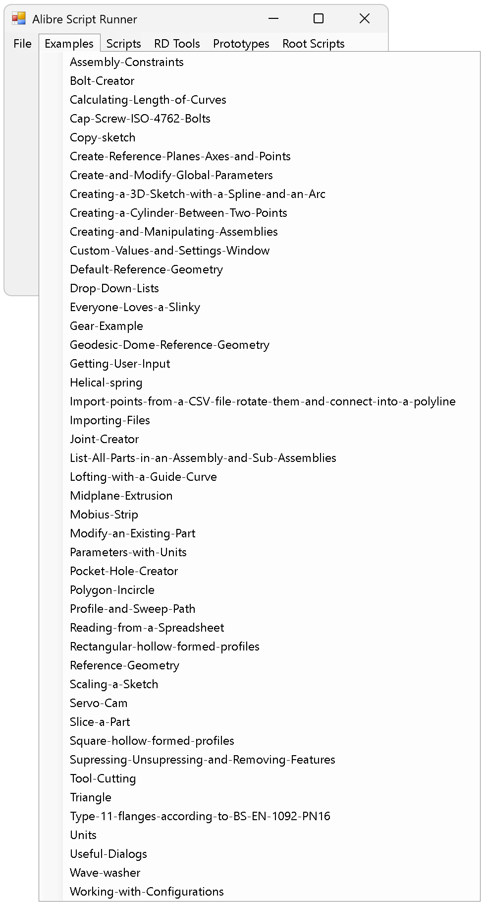

A collection of tools and utilities aimed at bringing Alibre Script and Alibre Design automation into 2025.

## main.py example
- Launch from the Alibre Script addon
- After the window (see below) is open you can close the Alibre Script addon scripting interface
- This is only an example or starting point for a project or script

### Enhancement Ideas

- [X] Autoload scripts from files [Issue](https://github.com/Testbed-for-Alibre-Design/Alibre-Script-Runner/issues/2)
- [X] Add dynamic menu creation
- [X] Preload Alibre Script addon libraries
- [ ] Add auto-detect Alibre Version tool or registry check to select correct version number.  

### Known Issues
- Some examples simply don’t work.
- File and folder paths need to be updated to match your personal file system.
- These scripts have been updated using AI. Results may vary. * I create, test and review the code. AI is utlitilzed but nothing is committed without my full review and testing.
- Code is included that is not required for the Alibre Script addon, but is required when using the [Alibre Python Shell addon](https://github.com/Testbed-for-Alibre-Design/AlibrePythonShellAddon).
- The Alibre Design installation location is hard-coded for 'Alibre Design 28.0.2.28126,' which is the installed version on the build machine.
