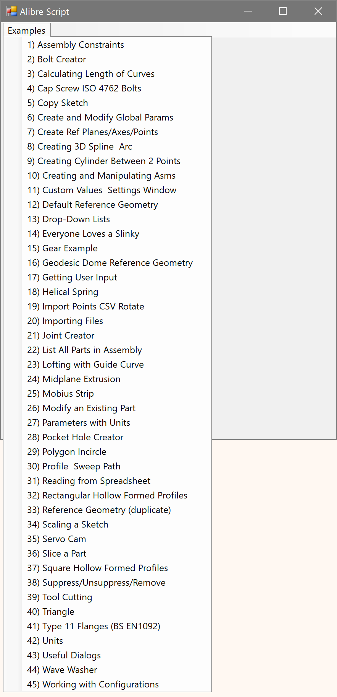

A collection of tools and utilities aimed at bringing Alibre Script and Alibre Design automation into 2025.

Contrary to the repository’s name, there is no actual hacking taking place.

## hacking-alibre-script-addon.py example
- Launch from the Alibre Script addon
- After the window (see below) is open you can close the Alibre Script addon scripting interface
- This is only an example or starting point for a project or script

### Todos

- [ ] Autoload scripts from files
- [ ] Add dynamic menu creation
- [ ] Preload Alibre Script addon libraries

#### Known Issues
- Some examples simply don’t work.
- File and folder paths need to be updated to match your personal file system.
- These scripts have been updated using AI. Results may vary.
- Code is included that is not required for the Alibre Script addon, but is required when using the [Alibre Python Shell addon](https://github.com/Testbed-for-Alibre-Design/AlibrePythonShellAddon).
